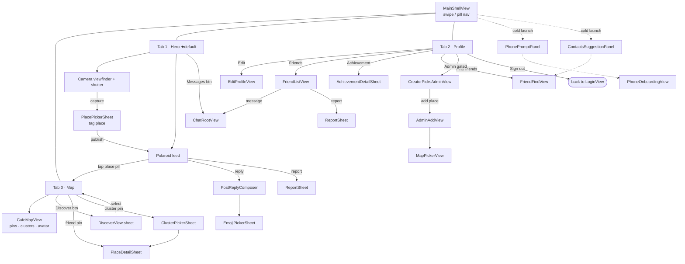
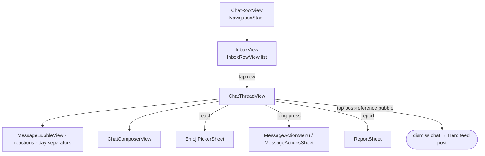

# CafeHunter — App Architecture & Screen Flow

> SwiftUI + Firebase iOS app. This doc maps **the order screens appear in**, **the files behind each screen**, and **the overall project structure**. Written to be shared with design.

- **Stack:** SwiftUI · Firebase (Auth, Firestore, App Check) · Google Places · MapKit
- **Pattern:** `Models` (data) → `Services` (`@Observable` Firebase logic) → `Views` (feature folders)
- **Two routers:** `ContentView` (state-driven gate) → `MainShellView` (3-tab swipe shell)

---

## 1. Screen flow — launch & authentication

`ContentView` is the root router. It watches auth + onboarding state and swaps the whole screen. The user falls through each gate in order until they reach the main app.

```mermaid
flowchart TD
    A[CafeHunterApp<br/>@main entry] --> B[ContentView<br/>state router]

    B -->|isLoading| SPLASH[SplashView<br/>spinning pin]
    B -->|user == nil<br/>+ not seen welcome| W[WelcomeView<br/>3-card carousel]
    B -->|user == nil<br/>+ has seen welcome| L[LoginView]
    W -->|onComplete| L

    L -->|Apple / Google / email| GATE{Onboarding<br/>gates}
    GATE -->|needsUsername| U[UsernameOnboardingView]
    GATE -->|needsBirthdate / consent| BD[BirthdateOnboardingView]
    GATE -->|needsPhone| PH[PhoneOnboardingView]
    U --> GATE
    BD --> GATE
    PH --> GATE
    GATE -->|all passed| SHELL([MainShellView ★])

    BD -.legal links.-> LEGAL[Legal URL sheets]
```

---

## 2. Screen flow — main shell (the 3-tab home)

`MainShellView` hosts three horizontally-swipeable pages with the floating pill nav bar. **Hero (center) is the default tab.**



### Chat surface (`ChatRootView` — a `NavigationStack` inside a fullScreenCover)



**Entry points into chat:** Hero "Messages" button opens on the **Inbox**; a friend row (Profile → Friends, or Profile message action) opens **straight into the thread**. Either way the user can pop back to the inbox.

---

## 3. Files behind each screen

| Screen | Primary view file | Supporting files |
|---|---|---|
| **Entry** | `CafeHunterApp.swift` | `AppDelegate.swift` |
| **Router** | `ContentView.swift` (also defines `SplashView`) | — |
| **Welcome** | `Auth/WelcomeView.swift` | — |
| **Login** | `Auth/LoginView.swift` | `Auth/AuthTextField.swift`, `Shared/AppleSignInNonce.swift` |
| **Username onboarding** | `Auth/UsernameOnboardingView.swift` | — |
| **Birthdate / consent** | `Auth/BirthdateOnboardingView.swift` | `Models/LegalURLs.swift` |
| **Phone onboarding** | `Auth/PhoneOnboardingView.swift` | `Auth/PhonePromptPanel.swift` |
| **Main shell** | `Main/MainShellView.swift` | `Navigation/RollerNavBar.swift` (`ArcNavBar` + `ShellPage`) |
| **Map tab** | `Main/MainMapView.swift` | `Main/CafeMapView.swift`, `Main/DiscoverView.swift`, `Main/FriendPlaceCard.swift` |
| **Place detail (map)** | `PostPlaceTag/PlaceDetailSheet.swift` | — |
| **Hero tab (camera + feed)** | `Hero/HeroPageView.swift` | `Hero/HeroCameraLayout.swift`, `Hero/PolaroidFrame.swift`, `Hero/PlainFeedFrame.swift`, `Hero/PostReplyComposer.swift`, `Camera/CameraPreviewView.swift`, `Camera/SquareVideoFillView.swift` |
| **Post a place** | `PostPlaceTag/PlacePickerSheet.swift` | `PostPlaceTag/PlaceDetailSheet.swift` |
| **Profile tab** | `Profile/ProfileHomeView.swift` | `Profile/EditProfileView.swift`, `Profile/FriendListView.swift`, `Profile/ProfileView.swift` |
| **Find friends** | `Friends/FriendFindView.swift` | `Friends/ContactsSuggestionPanel.swift` |
| **Chat** | `Chat/ChatRootView.swift` | `Chat/ChatRoute.swift`, `Chat/Inbox/*`, `Chat/Thread/*`, `Chat/Support/*` |
| **Admin** | `Admin/CreatorPicksAdminView.swift` | `Admin/AdminAddView.swift`, `Admin/MapPickerView.swift` |
| **Shared sheets** | `Shared/ReportSheet.swift`, `Shared/EmojiPickerSheet.swift` | — |

---

## 4. Overall project structure

```
CafeHunter/
├── CafeHunterApp.swift            # @main entry, Google Places + audio session setup
├── AppDelegate.swift              # FirebaseApp.configure() (swizzling-off for Phone Auth)
├── ContentView.swift              # ★ Root router + SplashView
│
├── Theme/
│   └── AppTheme.swift             # colors (espresso, cream, accents), liquidGlass chrome
│
├── Models/                        # plain data types (Codable / Firestore docs)
│   ├── Cafe.swift
│   ├── SocialModels.swift         # posts, friends, conversations, messages
│   ├── UserPrivate.swift          # birthdate / phone / consent gating flags
│   ├── Achievement.swift
│   ├── MediaDraft.swift
│   ├── Moderation.swift
│   └── LegalURLs.swift
│
├── Services/                      # business logic / Firebase access (the "controllers")
│   ├── AuthService.swift          # drives ContentView's user / isLoading
│   ├── PhoneAuthService.swift     # SMS OTP
│   ├── AppCheckProviderFactory.swift
│   ├── FirestoreService.swift     # cafe / post live subscriptions
│   ├── SocialService.swift        # profile, username, friends, posts
│   ├── UserPrivateService.swift   # onboarding gates + prompt flags
│   ├── ConversationService.swift  # chat inbox + threads
│   ├── UserStatsService.swift
│   ├── VisitTrackerService.swift  # opens / closes visit sessions by location
│   ├── DiscoverService.swift
│   ├── PlacePickerService.swift   # Google Places search
│   ├── FriendFindService.swift
│   ├── FriendPlacesService.swift
│   ├── ContactsService.swift
│   ├── NotificationService.swift
│   ├── CreatorPicksAdminService.swift
│   ├── CameraService.swift  /  CameraCaptureProcessing.swift
│   └── AppAudioSession.swift
│
├── Views/
│   ├── Auth/        # Welcome, Login, Username/Birthdate/Phone onboarding, AuthTextField
│   ├── Navigation/  # RollerNavBar (ArcNavBar + ShellPage enum)
│   ├── Main/        # MainShellView, MainMapView, CafeMapView, DiscoverView, FriendPlaceCard
│   ├── Hero/        # HeroPageView (camera+feed), Polaroid/PlainFeed frames, layout, reply composer
│   ├── Camera/      # CameraPreviewView, SquareVideoFillView (UIViewRepresentables)
│   ├── PostPlaceTag/# PlacePickerSheet, PlaceDetailSheet
│   ├── Profile/     # ProfileHomeView, EditProfileView, FriendListView, ProfileView
│   ├── Friends/     # FriendFindView, ContactsSuggestionPanel
│   ├── Chat/
│   │   ├── ChatRootView.swift, ChatRoute.swift
│   │   ├── Inbox/   # InboxView, InboxRowView, InboxEmptyState
│   │   ├── Thread/  # ChatThreadView, ChatHeaderView, ChatComposerView, MessageBubble,
│   │   │            #   MessageReactionStrip, MessageActionMenu/Sheet, DaySeparator,
│   │   │            #   PostReferenceBubbleView
│   │   └── Support/ # ParticipantHydrator, PendingMessageQueue, MessageGrouping, LinkifiedText
│   ├── Admin/       # CreatorPicksAdminView, AdminAddView, MapPickerView
│   ├── Cafes/       # CafeCardView, CafeDetailView  ⚠ DEAD CODE (see §5)
│   └── Shared/      # ReportSheet, EmojiPickerSheet
│
└── Shared/          # reusable utilities & view modifiers
    ├── FloatingPanelModifier.swift   # the .floatingPanel(...) used by Profile
    ├── CachedAsyncImage.swift, VideoCache.swift
    ├── FlowLayout.swift, Motion.swift, ReduceMotion.swift, ContrastAware.swift
    ├── KeyboardDismiss.swift, PostClassifier.swift
    ├── NotoEmojiLottieView.swift, AppleSignInNonce.swift
    └── (LocationProvider — singleton touched at launch)
```

### Presentation styles used
- **Tabs / pages:** horizontal swipe in `MainShellView` (Map · Hero · Profile)
- **`.fullScreenCover`:** Chat, Phone onboarding (soft path), Find friends, Admin
- **`.sheet`:** Place pickers/details, Discover, cluster picker, Report, Emoji, soft prompt panels
- **`.floatingPanel`** (custom modifier): Edit profile, Friend list, Achievement detail
- **`NavigationStack`:** only inside the Chat surface (so the composer tracks the keyboard for free)

---

## 5. Dead code note

`Views/Cafes/CafeCardView.swift` and `Views/Cafes/CafeDetailView.swift`:
- have **no call sites** anywhere in the Swift source, and
- are **not referenced in `project.pbxproj`** (i.e. not compiled into the build).

They are leftover from an earlier design and safe to delete. Flagged here so design doesn't assume a "cafe detail" screen exists in the shipping app — it doesn't; place detail is handled by `PostPlaceTag/PlaceDetailSheet.swift`.
